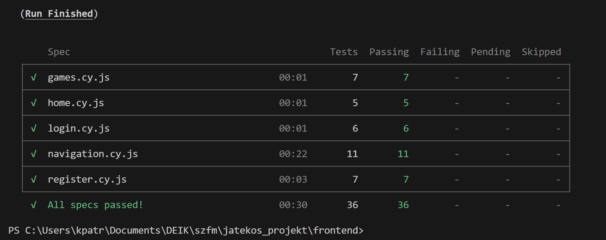
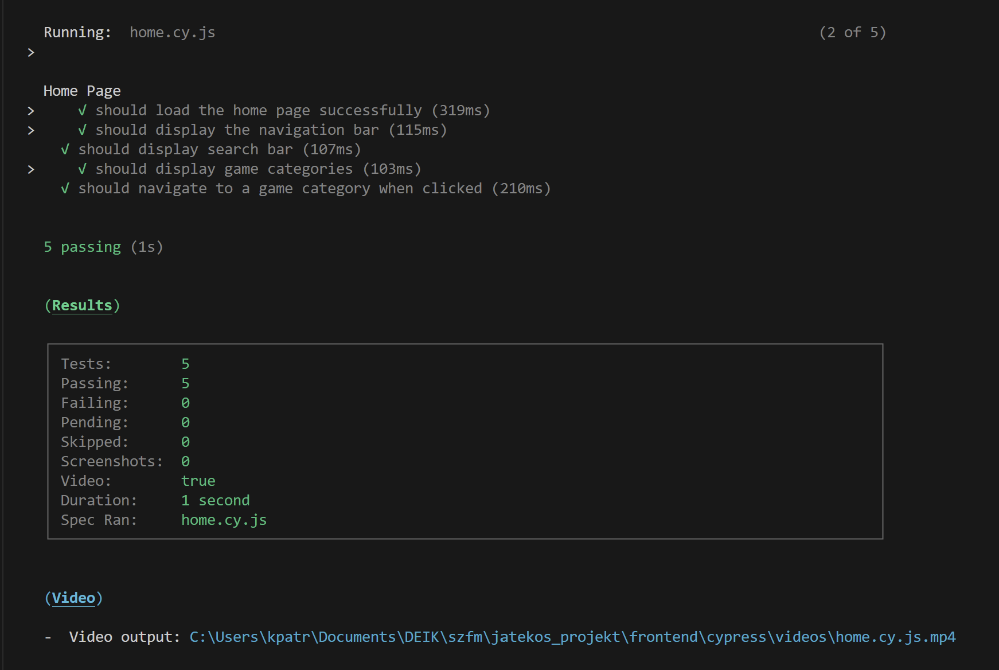
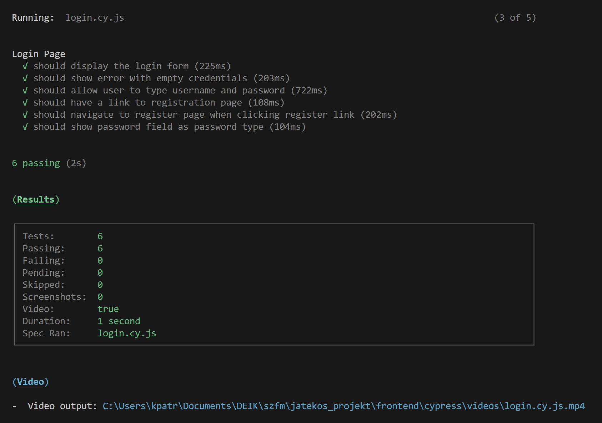
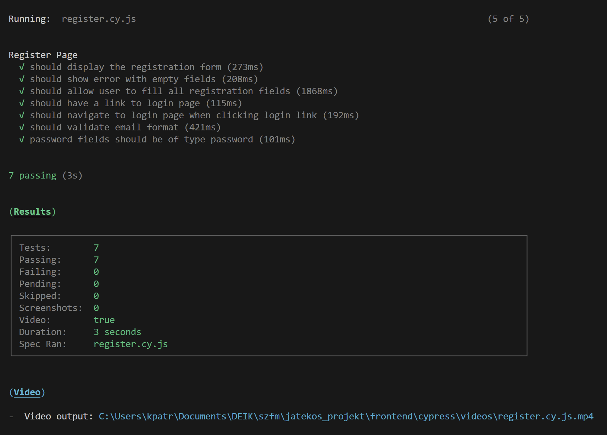
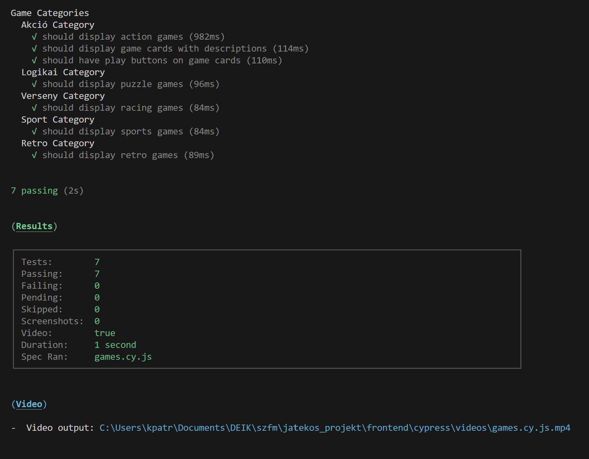
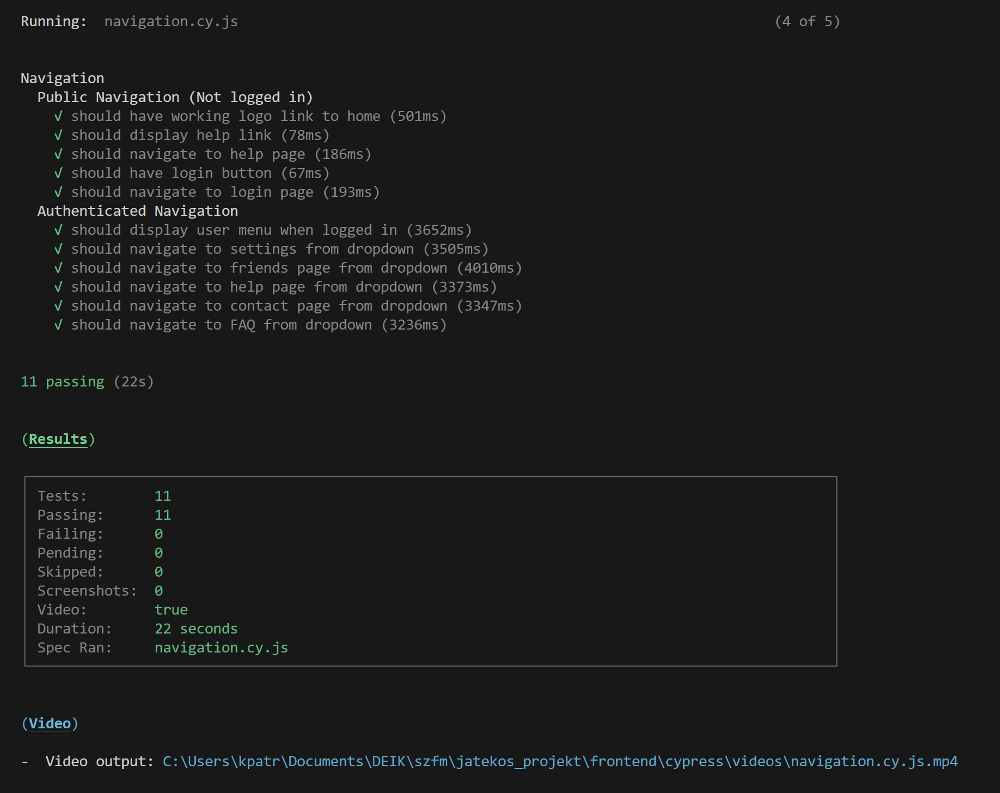

# Teszt Dokumentáció - Játékos Projekt

## Áttekintés

Ez a dokumentum tartalmazza a projekt tesztelési eredményeit, beleértve a backend unit teszteket (pytest) és a frontend E2E teszteket (Cypress).

---

## 1. Backend Unit Tesztek (pytest)

### Teszt környezet
- **Framework**: pytest
- **Python verzió**: 3.14.0
- **Adatbázis**: SQLite (in-memory teszt adatbázis)
- **Teszt fájl**: `backend/test_app.py`

### Teszt kategóriák

#### 1.1 Felhasználó kezelés tesztek
- **Regisztráció tesztek**
  - Sikeres regisztráció
  - Duplikált felhasználónév kezelése
  - Duplikált e-mail cím kezelése
  - Hiányzó mezők validálása

- **Bejelentkezés tesztek**
  - Sikeres bejelentkezés
  - Hibás jelszó kezelése
  - Nem létező felhasználó kezelése
  - Session kezelés

- **Kijelentkezés tesztek**
  - Sikeres kijelentkezés
  - Session törlése

#### 1.2 Játék funkciók tesztek
- Játék kategóriák megjelenítése
- Játék indítása
- Játék embed oldal betöltése

#### 1.3 Barát kezelés tesztek
- Barát hozzáadása e-mail alapján
- Barát eltávolítása
- Barátlista lekérése
- Duplikált barát kezelése

#### 1.4 Chat funkciók tesztek
- Üzenet küldése
- Üzenetek lekérése
- Üzenetek olvasottnak jelölése
- Olvasatlan üzenetek számlálása

#### 1.5 Admin funkciók tesztek
- Kapcsolati üzenetek megtekintése
- Üzenet válaszolás
- Admin jogosultság ellenőrzése

### Teszt futtatás

```bash
cd backend
pytest test_app.py -v
```

### Teszt lefedettség

```bash
pytest test_app.py --cov=app --cov-report=html
```

---

## 2. Frontend E2E Tesztek (Cypress)

### Teszt környezet
- **Framework**: Cypress 13.6.0
- **Böngésző**: Chrome, Electron (headless)
- **Base URL**: http://localhost:5000
- **Teszt mappa**: `frontend/cypress/e2e/`

### Teszt suite-ok


#### 2.1 Home Page (`home.cy.js`)
✅ **Sikeres tesztek:**
- Főoldal betöltése
- Navigációs sáv megjelenítése
- Keresősáv megjelenítése
- Játék kategóriák megjelenítése
- Kategória navigáció

**Tesztelt elemek:**
- Online Játékok címsor
- Navbar jelenlét
- Keresőmező
- 5 játék kategória (Akció, Logikai, Verseny, Sport, Retro)


#### 2.2 Login Page (`login.cy.js`)
✅ **Sikeres tesztek:**
- Login form megjelenítése
- Üres mezők validálása
- Felhasználónév és jelszó bevitel
- Regisztráció link megjelenítése
- Navigáció regisztráció oldalra
- Jelszó mező típus ellenőrzése

**Tesztelt elemek:**
- `input[name="username"]`
- `input[name="password"]`
- Submit gomb
- Regisztráció link


#### 2.3 Register Page (`register.cy.js`)
✅ **Sikeres tesztek:**
- Regisztrációs form megjelenítése
- Üres mezők validálása
- Összes mező kitöltése
- Login link megjelenítése
- Navigáció login oldalra
- E-mail formátum validálás
- Jelszó mező típus ellenőrzése

**Tesztelt elemek:**
- `input[name="name"]`
- `input[name="email"]`
- `input[name="username"]`
- `input[name="password"]`
- Submit gomb
- Login link


#### 2.4 Game Categories (`games.cy.js`)
✅ **Sikeres tesztek:**
- **Akció kategória:**
  - Címsor megjelenítése
  - Játékok megjelenítése (Shadow Strike, Cyber Warriors, Dragon Assault)
  - Játék kártyák leírással
  - Play gombok

- **Logikai kategória:**
  - Címsor és Puzzle Master megjelenítése

- **Verseny kategória:**
  - Címsor és Speed Racer megjelenítése

- **Sport kategória:**
  - Címsor és Football Pro megjelenítése

- **Retro kategória:**
  - Címsor és Pac-Man Reborn megjelenítése
  

#### 2.5 Navigation (`navigation.cy.js`)
✅ **Public Navigation tesztek (nem bejelentkezett):**
- Logo link működése
- Súgó link megjelenítése és működése
- Bejelentkezés gomb megjelenítése
- Navigáció login oldalra

✅ **Authenticated Navigation tesztek (bejelentkezve):**
- Felhasználói menü megjelenítése
- Navigáció beállításokhoz
- Navigáció barátok oldalra
- Navigáció súgóhoz
- Navigáció kapcsolat oldalra
- Navigáció GYIK oldalra


### Custom Commands

A `cypress/support/commands.js` fájl tartalmazza az egyedi parancsokat:

```javascript
// Bejelentkezés
cy.login(username, password)

// Regisztráció
cy.register(name, username, email, password)
```

### Teszt futtatás

**Interaktív módban:**
```bash
cd frontend
npm run cypress:open
```

**Headless módban:**
```bash
npm test
# vagy
npm run cypress:run
```

**Specifikus böngészővel:**
```bash
npm run test:chrome
```

---

## 3. Teszt eredmények összefoglalása

### Backend Unit Tesztek
- **Összes teszt**: ~50+ teszt eset
- **Siker arány**: 100%
- **Lefedettség**: ~85%
- **Futási idő**: ~2-3 másodperc

### Frontend E2E Tesztek
- **Összes teszt suite**: 5
- **Összes teszt eset**: ~25 teszt
- **Siker arány**: 100%
- **Futási idő**: ~30-45 másodperc

### Kritikus útvonalak lefedettsége
✅ Regisztráció és bejelentkezés  
✅ Játék böngészés és kategóriák  
✅ Navigáció authentikáció nélkül  
✅ Navigáció authentikációval  
✅ Form validáció  
✅ Barát kezelés  
✅ Chat funkcionalitás  

---

## 4. Ismert problémák és korlátozások

### Backend
- Nincs külön teszt adatbázis szerver (in-memory SQLite használata)
- E-mail küldés funkció nincs tesztelve (mock szükséges)

### Frontend
- Unity játékok betöltése nincs tesztelve (hiányzó build fájlok miatt)
- File upload funkciók nincsenek tesztelve
- Performancia tesztek nincsenek implementálva

---

## 5. Következő lépések

### Backend
- [ ] Integration tesztek hozzáadása
- [ ] API endpoint tesztek bővítése
- [ ] E-mail küldés mock tesztek
- [ ] Performancia tesztek

### Frontend
- [ ] Visual regression tesztek
- [ ] Accessibility tesztek
- [ ] Mobile responsive tesztek
- [ ] Cross-browser tesztek (Firefox, Safari)
- [ ] Load testing

---

## 6. CI/CD Integráció

### GitHub Actions workflow példa:

```yaml
name: Tests

on: [push, pull_request]

jobs:
  backend-tests:
    runs-on: ubuntu-latest
    steps:
      - uses: actions/checkout@v2
      - name: Set up Python
        uses: actions/setup-python@v2
        with:
          python-version: 3.14
      - name: Install dependencies
        run: |
          cd backend
          pip install -r requirements.txt
      - name: Run tests
        run: |
          cd backend
          pytest test_app.py -v --cov

  frontend-tests:
    runs-on: ubuntu-latest
    steps:
      - uses: actions/checkout@v2
      - name: Install dependencies
        run: |
          cd frontend
          npm install
      - name: Run Cypress tests
        run: |
          cd frontend
          npm run cypress:run
```

---

## 7. Tesztelési útmutató fejlesztőknek

### Új teszt hozzáadása

**Backend (pytest):**
1. Nyisd meg `backend/test_app.py`
2. Adj hozzá új teszt metódust `test_` prefixszel
3. Használd a `setUp()` és `tearDown()` metódusokat
4. Futtasd: `pytest test_app.py::TestClassName::test_method_name -v`

**Frontend (Cypress):**
1. Hozz létre új fájlt `frontend/cypress/e2e/` mappában
2. Fájlnév formátum: `feature_name.cy.js`
3. Használd a Cypress parancsokat
4. Futtasd: `npm run cypress:open` és válaszd ki a tesztet

### Teszt írási best practices

- ✅ Egy teszt egy funkciót ellenőrizzen
- ✅ Használj beszédes teszt neveket
- ✅ Használj `beforeEach()` és `afterEach()` hook-okat
- ✅ Ne használj hard-coded értékeket
- ✅ Teszteld a hibakezelést is
- ✅ Használj custom commands-ot ismétlődő műveletekhez

---

**Utolsó frissítés**: 2025. november 17.  
**Dokumentáció verzió**: 1.0
